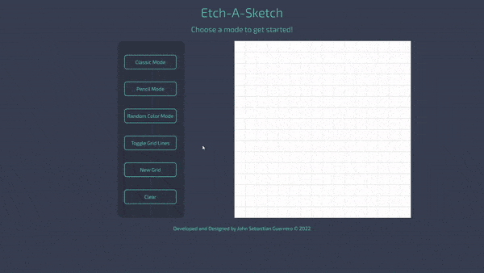

# Etch-A-Sketch
An etch-A-sketch app that allows you to simulate the classic etch-a-sketch with your mouse. It allows multiple modes, as well as customizing the grid size and toggling grid lines.

**Link to project:** https://johnsebastian3.github.io/etch-a-sketch/

## How It's Made:

**Tech used:** HTML, CSS, JavaScript

I made this by adding a mouseover event listener to every grid cell in the sketching area. This allowed me to play around with the mouse, and achieve a sketching experience. To allow different modes, I just had to add event listeners to the mode buttons. 

## Optimizations

Optimizations planned are refactoring code.

## Lessons Learned:

I learned a lot about event listeners during this project. Because of the nature of the way the sketching worked, I had to figure out a way to get the mouse to cause an even every time it touched a new cell. In the case of the "pencil" mode, I had to make it so that each subsequent mouseover would make the cell a little bit darker. All of these little details in the end made me more confident when working with event listeners.

